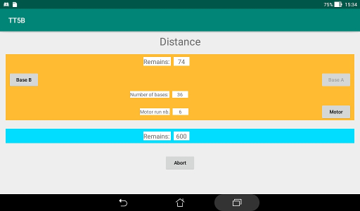

Talking Timer for F5B
=====================

## Purpose
The purpose of this Android application is to help the coaching
of a pilot in a F5B competition: see
[FAI](https://fai.org/page/f5-electric-flight).

The application issues a countdown for each of the tasks "Distance"
and "Duration".  
There are also buttons to count the number of legs performed and the number
of the motor runs during the Distance task.  
The timer could still be used if no button is pushed (excepted the Start). 

## Installation
The application should be compiled from the sources in this repository
or downloaded from the **Releases** pages.

## Permissions
No additional permission is required.  
The screen is kept On.  
The application keeps its initial orientation.  
The English voice is used.

## Starting
A **START** button is initially occupying most of the area of the screen.  
It should be pushed synchronized with the launch of the plane.

An acknowledgment under the form of an announcement "Distance"
is made 5 s after pushing.

The initial motor run and the first passage at the A base are already
counted.

## Distance task
The associated panel has an orange background while the task is
active (200 s). It contains indications about the time remaining,
the number of legs that have been traveled and the number of motor runs.

### Announcements
One announce at the half of the task: 100.  
Starting at 50 s remaining: each 10 s the time remaining.  
Starting at 10 s remaining: each second.

### Base buttons
Only one at a time of the button is enabled.  
The appropriate button should be pushed when the signal is given that
the plane has passed a base.

It is assumed that the device is two handed supported.

### Motor button
This button should be pushed each time the motor is run to increment the
count.

The rules specify a maximum of 10 motor runs.  
At the ninth run the background of the box where the count is displayed
turns yellow. And turns red for the tenth run.  
Starting at the eighth run, an announcement "Motor x" is issued
3 s after the button has been pushed. This kind of announcement is
muted in the last 10 s of the task.

## Duration task
The start of this task is immediately at the end of the distance task.
The background for the panel of this task turns orange while the
distance panel turns blue and its buttons are disabled.

The remaining time is displayed in seconds, starting at 600.  
There is no button for this task.

### Announcements
10 s after start of task: Duration.  
Starting 5 minutes remaining, each minute: x minutes.  
Starting at the last minute: each 10 s the time remaining.  
Last 10 s: each second.

## Thanks
Thanks to Dieter for testing.

